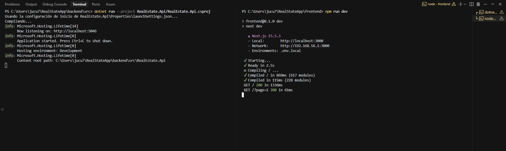
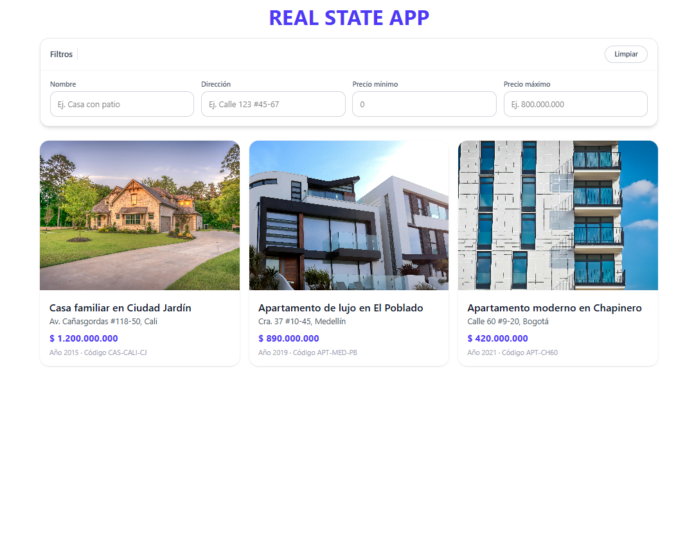
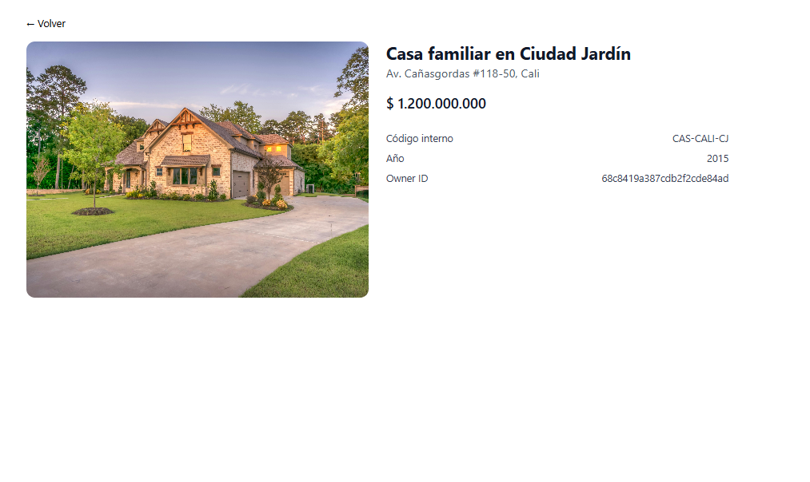
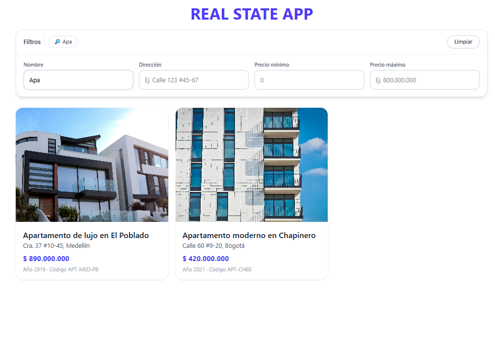
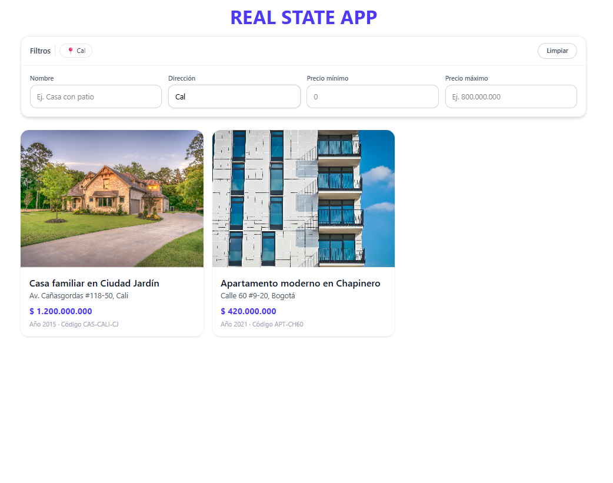

# Real Estate App - Frontend

Una aplicación web moderna para gestión de propiedades inmobiliarias construida con Next.js 15, TypeScript y Tailwind CSS.

## 🏗️ Arquitectura

### Frontend (Next.js 15)
- **Framework**: Next.js 15 con App Router
- **Lenguaje**: TypeScript
- **Estilos**: Tailwind CSS
- **Estado**: React Hooks y Context API
- **HTTP Client**: Fetch API nativo

### Backend (.NET 9)
- **Framework**: .NET 9 con Minimal APIs
- **Base de Datos**: MongoDB
- **Validación**: FluentValidation
- **Arquitectura**: Clean Architecture (Domain, Application, Infrastructure, API)

## 🚀 Características

### ✨ Funcionalidades Principales
- **Gestión de Propiedades**: CRUD completo con búsqueda avanzada
- **Gestión de Propietarios**: Administración de dueños de propiedades
- **Galería de Imágenes**: Subida y gestión de imágenes por propiedad
- **Trazas de Ventas**: Historial de transacciones con impuestos
- **Filtrado Avanzado**: Por nombre, dirección y rango de precios
- **Paginación**: Navegación eficiente de resultados
- **Polling en Tiempo Real**: Actualización automática de datos

### 🔍 Filtrado Inteligente
- **Precio Mínimo**: Filtra desde el valor especificado hasta infinito
- **Precio Máximo**: Filtra desde 0 hasta el valor especificado
- **Rango de Precios**: Filtra entre mínimo y máximo
- **Búsqueda por Texto**: Nombre y dirección con coincidencias parciales
- **Corrección Automática**: Intercambia min/max si están invertidos

### 🎨 Interfaz de Usuario
- **Diseño Responsivo**: Optimizado para móvil, tablet y desktop
- **UI Moderna**: Componentes con Tailwind CSS
- **Filtros Visuales**: Tags que muestran filtros activos
- **Navegación Intuitiva**: Paginación clara y accesible
- **Estados de Carga**: Indicadores visuales durante las operaciones

## 🛠️ Tecnologías

### Frontend
- **Next.js 15**: Framework React con App Router
- **TypeScript**: Tipado estático
- **Tailwind CSS**: Framework de estilos utilitarios
- **React Hooks**: Gestión de estado y efectos
- **Fetch API**: Cliente HTTP nativo

### Backend
- **.NET 9**: Framework de desarrollo
- **MongoDB**: Base de datos NoSQL
- **FluentValidation**: Validación de modelos
- **Minimal APIs**: Endpoints RESTful
- **Docker**: Containerización

## 📦 Instalación y Configuración

### Prerrequisitos
- Node.js 18+ 
- .NET 9 SDK
- Docker y Docker Compose
- MongoDB (via Docker)

### 1. Clonar el Repositorio
```bash
git clone <repository-url>
cd RealStateApp
```

### 2. Configurar Backend
```bash
# Navegar al directorio del backend
cd backend

# Iniciar MongoDB con Docker
cd docker
docker-compose up -d

# Volver al directorio src
cd ../src

# Restaurar dependencias
dotnet restore

# Ejecutar el backend
dotnet run --project RealEstate.Api/RealEstate.Api.csproj
```

El backend estará disponible en: `http://localhost:5046`

### 3. Configurar Frontend
```bash
# Navegar al directorio del frontend
cd frontend

# Instalar dependencias
npm install

# Ejecutar en modo desarrollo
npm run dev
```

El frontend estará disponible en: `http://localhost:3000`

## 🔧 Configuración

### Variables de Entorno
El frontend se conecta automáticamente al backend en `http://localhost:5046`. Para cambiar la URL del backend, crea un archivo `.env.local`:

```env
NEXT_PUBLIC_API_BASE_URL=http://localhost:5046
```

### Base de Datos
MongoDB se ejecuta en `localhost:27017` con la base de datos `realstate_db`. La configuración se encuentra en `backend/src/RealEstate.Api/appsettings.json`.

## 📚 API Endpoints

### Propiedades
- `GET /api/v1/properties` - Listar propiedades con filtros
- `GET /api/v1/properties/{id}` - Obtener propiedad por ID
- `POST /api/v1/properties` - Crear nueva propiedad
- `PUT /api/v1/properties/{id}` - Actualizar propiedad
- `DELETE /api/v1/properties/{id}` - Eliminar propiedad

### Propietarios
- `GET /api/v1/owners/{id}` - Obtener propietario por ID
- `POST /api/v1/owners` - Crear nuevo propietario
- `PUT /api/v1/owners/{id}` - Actualizar propietario
- `DELETE /api/v1/owners/{id}` - Eliminar propietario

### Imágenes
- `GET /api/v1/properties/{id}/images` - Listar imágenes de propiedad
- `POST /api/v1/properties/{id}/images` - Subir nueva imagen
- `PUT /api/v1/properties/{id}/images/{imageId}/enabled` - Habilitar/deshabilitar imagen
- `DELETE /api/v1/properties/{id}/images/{imageId}` - Eliminar imagen

### Trazas
- `GET /api/v1/properties/{id}/traces` - Listar trazas de propiedad
- `POST /api/v1/properties/{id}/traces` - Crear nueva traza
- `DELETE /api/v1/properties/{id}/traces/{traceId}` - Eliminar traza

## 🏃‍♂️ Uso

### Filtrado de Propiedades
1. **Por Precio**: Usa los campos "Precio mínimo" y "Precio máximo"
   - Solo mínimo: propiedades desde ese precio hacia arriba
   - Solo máximo: propiedades desde 0 hasta ese precio
   - Ambos: rango específico de precios

2. **Por Texto**: Busca por nombre o dirección de la propiedad

3. **Combinado**: Puedes usar múltiples filtros simultáneamente

### Navegación
- **Paginación**: Usa los botones "Prev" y "Next" para navegar
- **Tamaño de página**: Configurable (por defecto 20 elementos)
- **URLs**: Los filtros se sincronizan con la URL para compartir

## 🧪 Testing

### Backend
```bash
cd backend/src
dotnet test
```

### Frontend
```bash
cd frontend
npm run build
npm run start
```

## 📁 Estructura del Proyecto

```
RealStateApp/
├── backend/
│   ├── src/
│   │   ├── RealEstate.Api/          # API Layer
│   │   ├── RealEstate.Application/  # Business Logic
│   │   ├── RealEstate.Domain/       # Domain Models
│   │   ├── RealEstate.Infrastructure/ # Data Access
│   │   └── RealEstate.Tests/        # Unit Tests
│   └── docker/
│       └── docker-compose.yml       # MongoDB Setup
└── frontend/
    ├── src/
    │   ├── app/                     # Next.js App Router
    │   ├── components/              # React Components
    │   ├── lib/                     # Utilities
    │   └── types/                   # TypeScript Types
    ├── public/                      # Static Assets
    └── package.json
```

## 🚀 Despliegue

### Backend
El backend se puede desplegar en cualquier plataforma que soporte .NET 9:
- Azure App Service
- AWS Elastic Beanstalk
- Google Cloud Run
- Docker containers

### Frontend
El frontend se puede desplegar en:
- Vercel (recomendado para Next.js)
- Netlify
- AWS S3 + CloudFront
- Azure Static Web Apps


## 📸 Capturas de Pantalla







---
